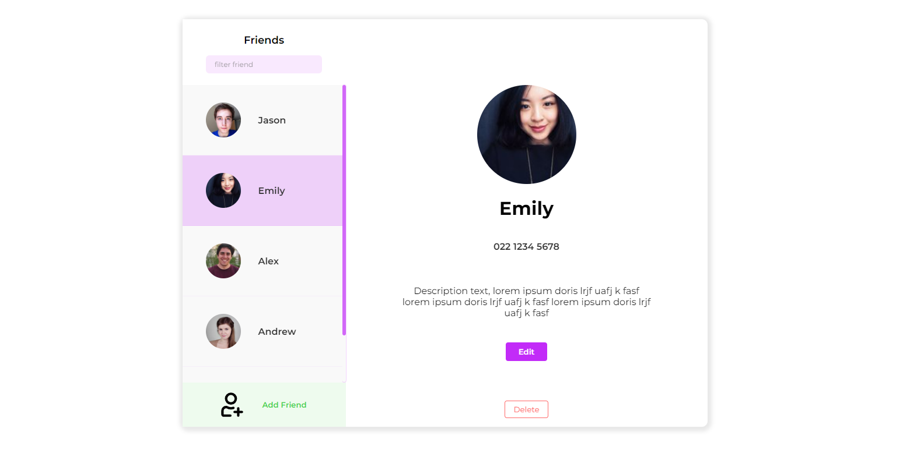

# WDCC - server-side JavaScript, Node.js, Express & APIs

## Description:
Part 2 of the WDCC workshop series: learning to use HTML/CSS, Node.js, React, to develop a contacts app. Original description below.

## Links:

* Link to slides: [tinyurl.com/wdcc-js-24](http://tinyurl.com/wdcc-js-24)
* Link to GitHub repo: [tinyurl.com/wdcc-js-repo-24](http://tinyurl.com/wdcc-js-repo-24)
* You will need to install Node.js: [nodejs.org](http://nodejs.org/)
* Suggested IDE: [code.visualstudio.com](http://code.visualstudio.com/)
* Postman: [postman.com](http://postman.com/)
* Zoom for screenshare: [tinyurl.com/wdcc-js-zoom-24](tinyurl.com/wdcc-js-zoom-24)

## Task:

The activity for this workshop will be based on a live demo working through and building the API. This will be shared on the projector and Zoom session; it will also be recorded to be shared later. 

This workshop will cover the content in the slides and then work through making a basic API that lets you Create, Read, Update and Delete data from a database.

This server-side workshop simplifies the practice of these concepts by not using a proper database; however, a mock database and data access functions have been included that simulate how a database would be accessed and modified through calls to JavaScript functions. Databases will be covered in a later workshop. 

The API created in this workshop is designed to be the server-side API that will connect to the user interface that was prototyped in the HTML & CSS workshop and the React user interface that you will create in the next workshop. 

The final user interface that will be completed at the end of the workshop series will allow a user to interact with the full functionality of the API you will build in this workshop and it look something like this and:

